# Hybrid Identity Lab — On-Prem AD on VirtualBox

A self-built lab environment for studying hybrid identity, Active Directory, and Microsoft Entra ID. Built as preparation for the SC-300 (Microsoft Identity and Access Administrator) certification.

## Goal

Stand up a realistic Active Directory environment (`contoso.local`) with proper OU structure, security groups, and 50 test users — the foundation needed for later phases that connect on-prem AD to Entra ID via Entra Connect, then layer Conditional Access, PIM, Access Reviews, and Global Secure Access on top.

## Lab topology

- **Host:** Windows 11
- **Hypervisor:** Oracle VirtualBox
- **Network:** LAB-NAT (10.0.2.0/24)
- **DC01:** Windows Server 2022, 4 GB RAM, static IP 10.0.2.10
- **Domain:** `contoso.local` (Windows Server 2016 functional level)

## Phases completed

### Phase 1 — VirtualBox network setup
Created a `LAB-NAT` NAT network on `10.0.2.0/24` with DHCP enabled to isolate lab VMs from the host network.

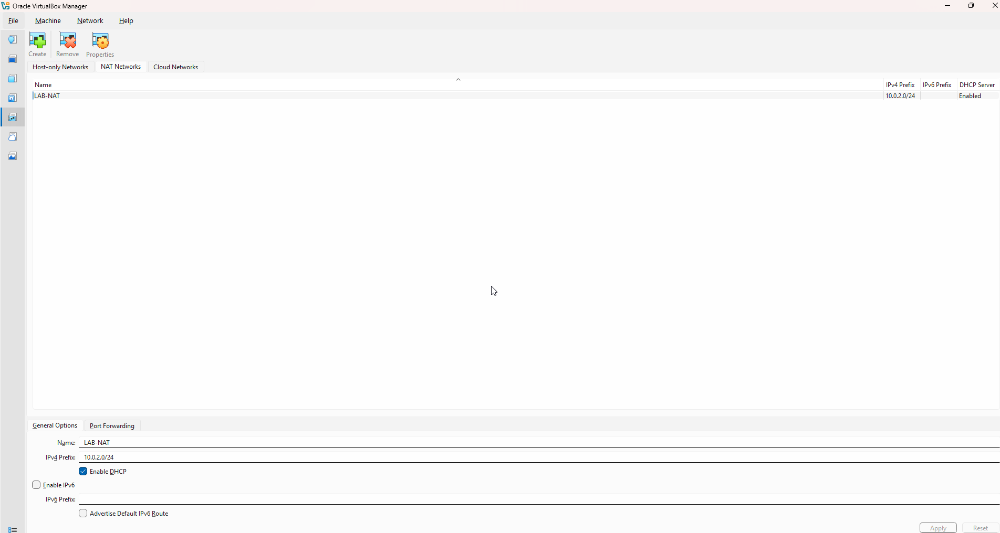

### Phase 2 — DC01 VM provisioning
Provisioned `DC01` running Windows Server 2022, attached to LAB-NAT, with a static IP of `10.0.2.10`.

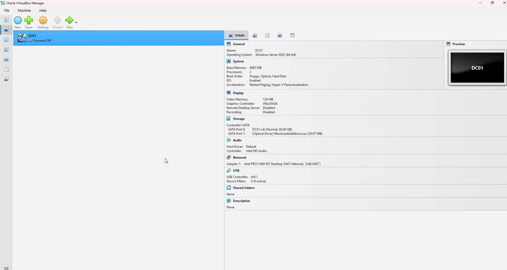
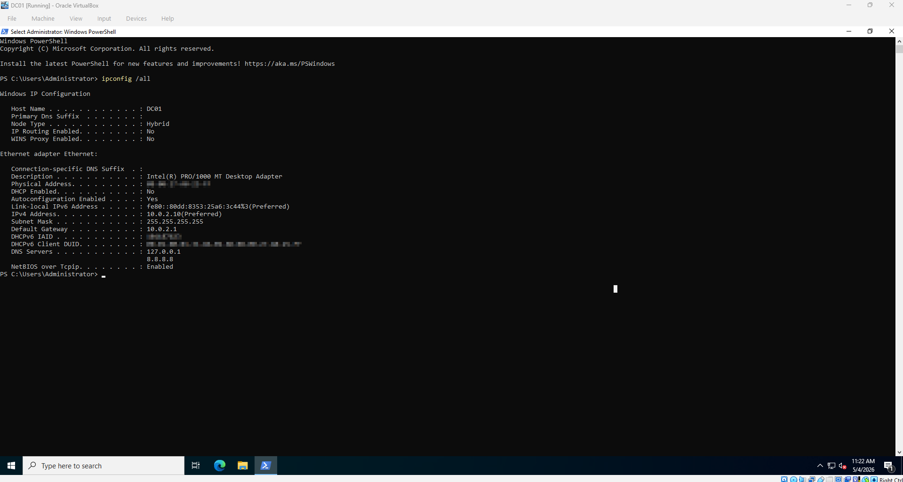

### Phase 3 — AD DS install and domain promotion
Installed the AD DS, DNS, and RSAT-AD-Tools roles, then promoted DC01 to a new forest at `contoso.local`. The promotion script ([`scripts/promote-dc.ps1`](scripts/promote-dc.ps1)) prompts for the DSRM password at runtime rather than hardcoding it.

Verified the domain is up and all four core AD services (ADWS, DNS, KDC, NTDS) are running.

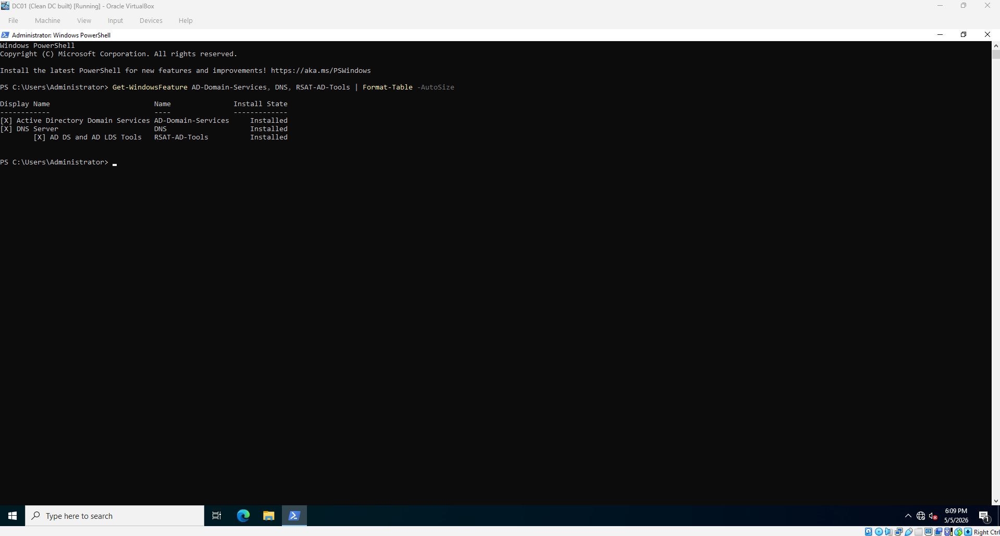

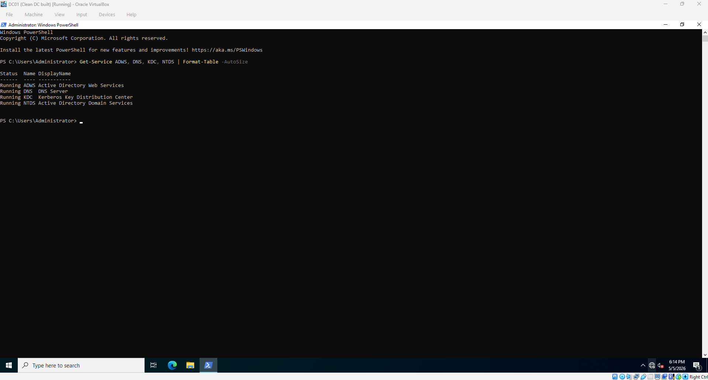

### Phase 5 — Populate AD with OUs, groups, and test users
Wrote a PowerShell script ([`scripts/02-populate-ad.ps1`](scripts/02-populate-ad.ps1)) that creates a tier-based OU structure, five department security groups (`GG-Finance-Users`, `GG-HR-Users`, `GG-IT-Users`, `GG-Marketing-Users`, `GG-Sales-Users`), and 50 test users distributed across the departments.

The script is **idempotent** — every create operation is guarded by a `Get-AD*` existence check, so it can be run repeatedly without errors or duplicate objects.

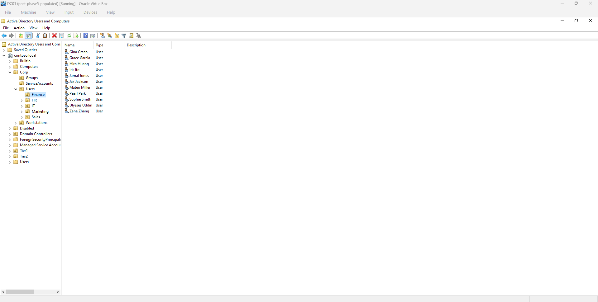
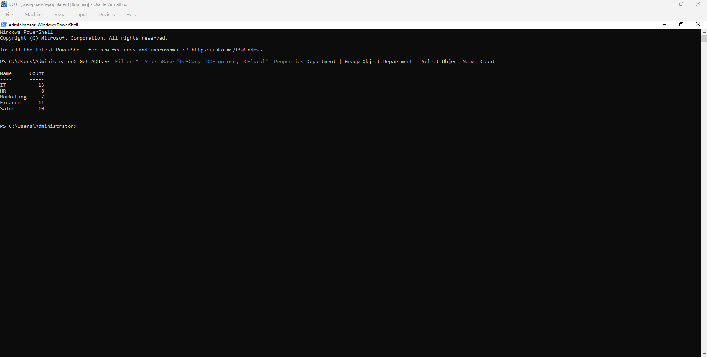
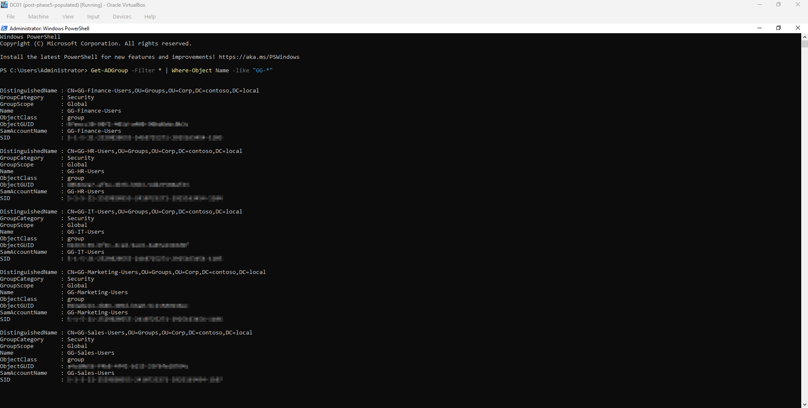
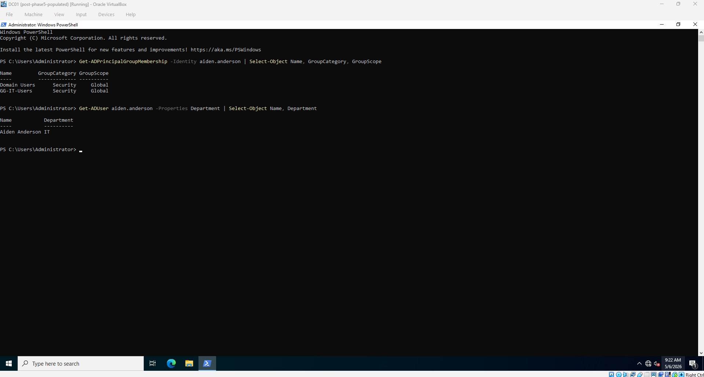
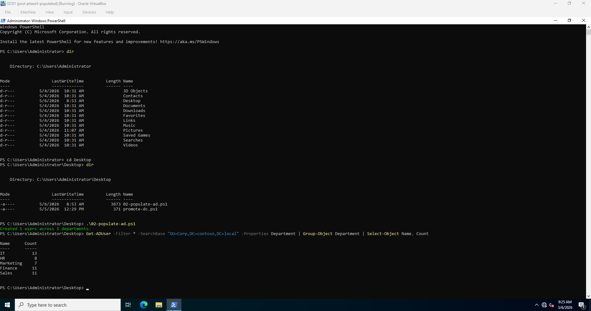
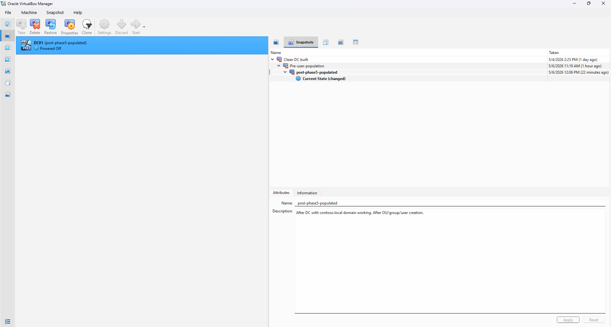

The `GG-*-Users` security groups are the foundation for later phases — once synced to Entra ID via Entra Connect, they become Conditional Access policy targets.

## Next phases

- **Phase 6:** Install and configure Microsoft Entra Connect
- **Phase 7:** Sync users and groups to a Microsoft 365 tenant
- **Phase 8:** Apply Conditional Access policies targeting the synced `GG-*-Users` groups
- **Phase 9:** Configure Privileged Identity Management (PIM) for tier-based admin roles
- **Phase 10:** Set up Access Reviews and Global Secure Access

## Notes on credentials and redaction

- Both PowerShell scripts in this repo use `Read-Host -AsSecureString` to prompt for passwords at runtime. No credentials are hardcoded or committed.
- Domain SIDs and ObjectGUIDs are blurred in screenshots where they appear.
- `contoso.local` is a destroyed lab environment. Any identifiers shown are not reusable.

## About me

Built by Serena Lin as part of SC-300 preparation.
